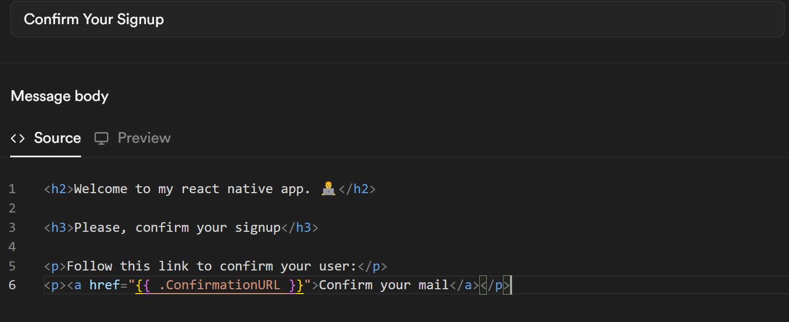

# Welcome to my Expo app 👋

## Summary
This is an [Expo](https://expo.dev) project created with [`create-expo-app`](https://www.npmjs.com/package/create-expo-app).

This app is a personal project to learn more about React Native, Expo, automated jobs, and Supabase tool options. It serves as a playground to try out new concepts and improve my skills.

- I have learned how to create an app using react native and Expo for visualization and debug. 
- I have implemented google 0auth and email confirmation for user's login and signup to my app.
- Supabase is used to connect my auth to the app and for other parts of the project such as database, cron automated jobs, and more to come.

The email template is configured in the Supabase auth page:

and will look like this when the email is sent:


## Get started (development)

1. Install dependencies

   ```bash
   npm install
   ```

2. Start the app

   ```bash
    npx start
   ```

For some reason my phone could not connect with the expo. Only locally (web) and by using the [android studio simulator](https://docs.expo.dev/workflow/android-studio-emulator/)

This project uses [file-based routing](https://docs.expo.dev/router/introduction).
